# Cassandra datastore implementation

This is a proof-of-concept implementation of Apache Cassandra as a backing datastore for SPIRE server. 

## Standard SPIRE RDBMS schema
### SPIRE Server SQL Schema Diagram

```mermaid
erDiagram
    bundles ||--o{ federated_registration_entries : "has"
    registered_entries ||--o{ federated_registration_entries : "has"
    registered_entries ||--o{ selectors : "has"
    registered_entries ||--o{ dns_names : "has"
    registered_entries ||--o{ registered_entries_events : "triggers"
    attested_node_entries ||--o{ attested_node_entries_events : "triggers"
    attested_node_entries ||--o{ node_resolver_map_entries : "has"

    bundles {
        uint id PK
        datetime created_at
        datetime updated_at
        varchar trust_domain UK "NOT NULL"
        blob data "MEDIUMBLOB"
    }

    registered_entries {
        uint id PK
        datetime created_at
        datetime updated_at
        varchar entry_id UK
        varchar spiffe_id "indexed"
        varchar parent_id "indexed"
        int ttl
        bool admin
        bool downstream
        bigint expiry "indexed"
        bigint revision_number
        bool store_svid
        varchar hint "indexed"
        int jwt_svid_ttl
    }

    selectors {
        uint id PK
        datetime created_at
        datetime updated_at
        uint registered_entry_id FK "indexed"
        varchar type "indexed"
        varchar value "indexed"
    }

    dns_names {
        uint id PK
        datetime created_at
        datetime updated_at
        uint registered_entry_id FK "indexed"
        varchar value "indexed"
    }

    federated_registration_entries {
        uint bundle_id PK,FK
        uint registered_entry_id PK,FK
    }

    attested_node_entries {
        uint id PK
        datetime created_at
        datetime updated_at
        varchar spiffe_id UK
        varchar data_type
        varchar serial_number
        datetime expires_at "indexed"
        varchar new_serial_number
        datetime new_expires_at
        bool can_reattest
    }

    attested_node_entries_events {
        uint id PK
        datetime created_at
        datetime updated_at
        varchar spiffe_id
    }

    node_resolver_map_entries {
        uint id PK
        datetime created_at
        datetime updated_at
        varchar spiffe_id "indexed"
        varchar type "indexed"
        varchar value "indexed"
    }

    registered_entries_events {
        uint id PK
        datetime created_at
        datetime updated_at
        varchar entry_id
    }

    join_tokens {
        uint id PK
        datetime created_at
        datetime updated_at
        varchar token UK
        bigint expiry
    }

    federated_trust_domains {
        uint id PK
        datetime created_at
        datetime updated_at
        varchar trust_domain UK "NOT NULL"
        varchar bundle_endpoint_url
        varchar bundle_endpoint_profile
        varchar endpoint_spiffe_id
        bool implicit
    }

    ca_journals {
        uint id PK
        datetime created_at
        datetime updated_at
        blob data "MEDIUMBLOB"
        varchar active_x509_authority_id "indexed"
        varchar active_jwt_authority_id "indexed"
    }

    migrations {
        uint id PK
        datetime created_at
        datetime updated_at
        int version
        varchar code_version
    }
```

#### Table Descriptions

- **bundles**: Stores trust bundles for trust domains
- **registered_entries**: Stores registration entries (workload identities)
- **selectors**: Selectors associated with registered entries
- **dns_names**: DNS names associated with registered entries
- **federated_registration_entries**: Join table linking bundles to registered entries for federation
- **attested_node_entries**: Stores attested nodes (agents)
- **attested_node_entries_events**: Event tracking for attested nodes
- **node_resolver_map_entries**: Node selectors for node resolution
- **registered_entries_events**: Event tracking for registered entries
- **join_tokens**: Join tokens for agent attestation
- **federated_trust_domains**: Configuration for federated trust domains
- **ca_journals**: CA journal for managing X509 and JWT authority rotation
- **migrations**: Tracks database schema version and SPIRE code version

## Cassandra Schema

## Implemented
- Alternative datastore configuration loading via experimental settings.
- Interface type for the cassandra implementation and restructuring of the existing plugin where necessary
- Basic scaffolding of methods without implementation

## To Be Implemented
- Pagination